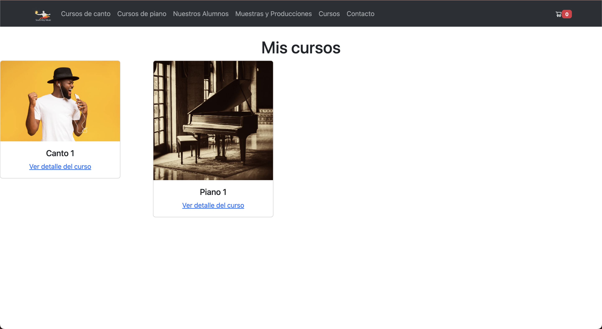

# Proyecto final E-Commerce Adrian Menet

## Introducción
El proyecto final consta de un E-Commerce en el cual se comercializan prestaciones de servicios educativos relacionados con la música.

## Tecnologías implementadas
- React
- Bootstrap 5
- React router
- React dom

## ¿Cómo iniciar el proyecto?
1. Clonamos el repositorio usando `git clone`
2. En la carpeta donde clonamos el repo, abrimos una terminal y escribimos `npm install`
3. Luego de finalizada la instalación de las dependencias, en la misma terminal escribimos `npm run dev`

## Capturas de pantalla
### Home

## Detalle del producto

## Carrito de compras

